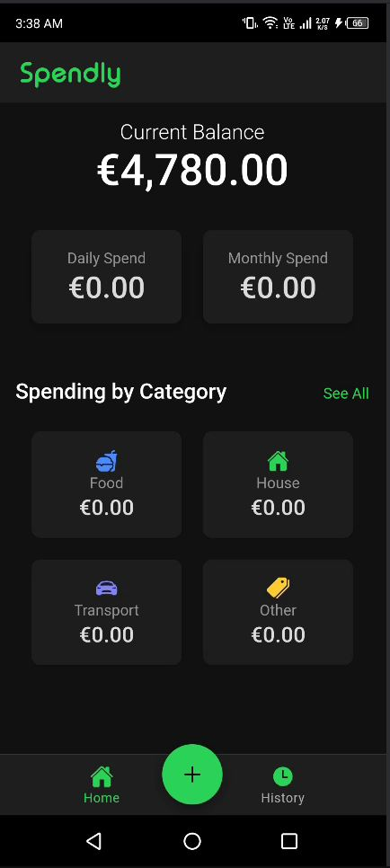

# Spendly

Spendly is a mobile application that I created as a study project of a real case application for me to use in Ireland (thats why the app is in EURO and the currency cannot be changed yet). Built with Ionic and Angular that helps users manage their finances by tracking transactions and categorizing expenses. Built with modern web technologies and mobile-first design.

## Table of Contents

- [Features](#features)
- [Technologies Used](#technologies-used)

## Features

- 💰 **Transaction Management**
  - Add/delete transactions with name, value, and category
  - Automatic balance calculation
- 📊 **Financial Insights**
  - Daily and monthly spending summaries
  - Visual spending breakdown by category
- 🗂 **Category Filtering**
  - Filter transactions by category (Food, Transport, House, Other)
  - Reset filters with one click
- 📱 **Mobile-First Design**
  - Responsive UI optimized for mobile devices
  - Native app feel with Capacitor integration

## Technologies Used

- **Frontend Framework**: Ionic + Angular
- **Mobile Runtime**: Capacitor
- **State Management**: Angular Services
- **Local Storage**
